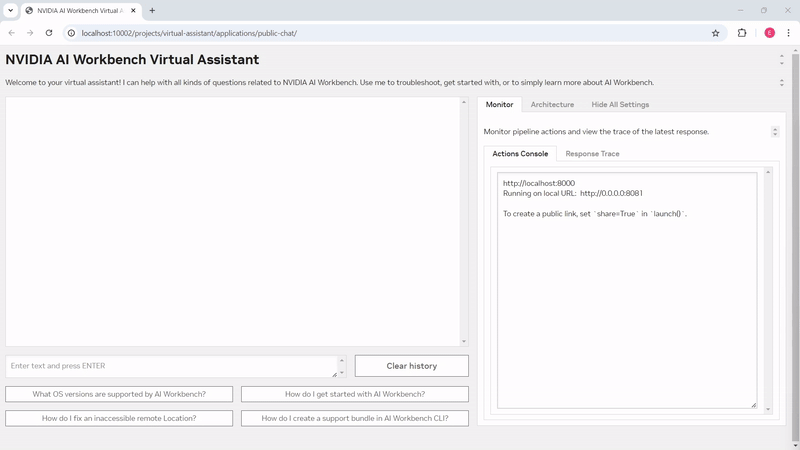
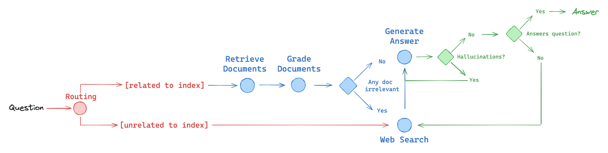
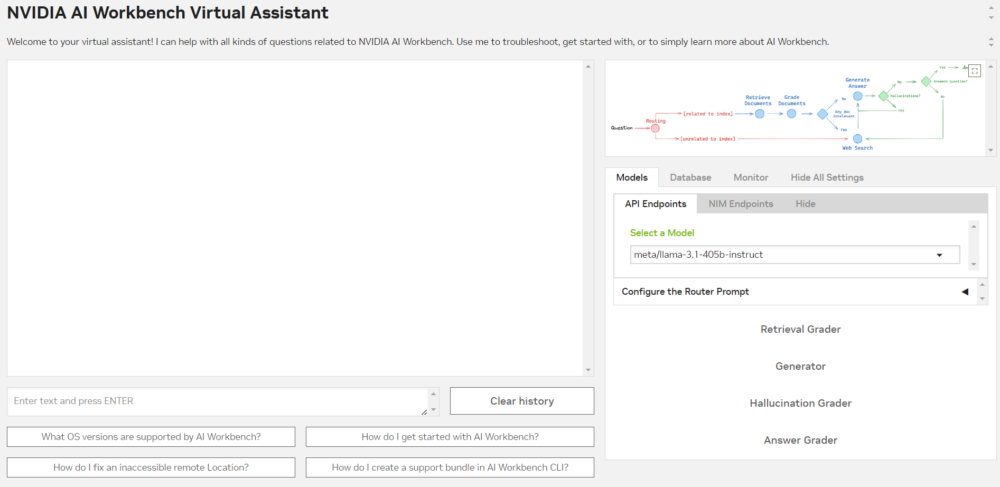
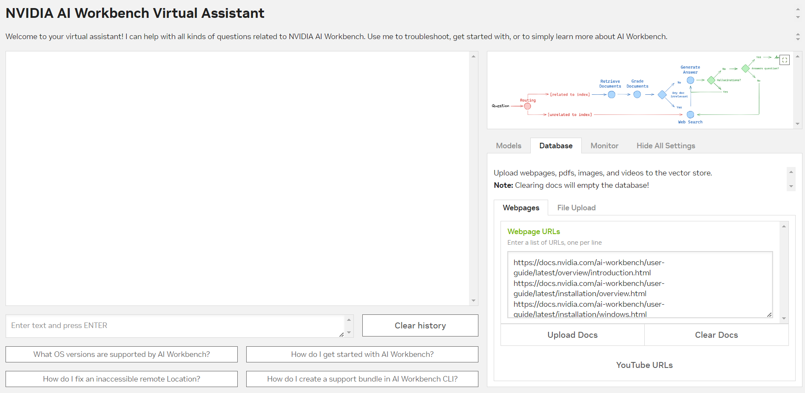
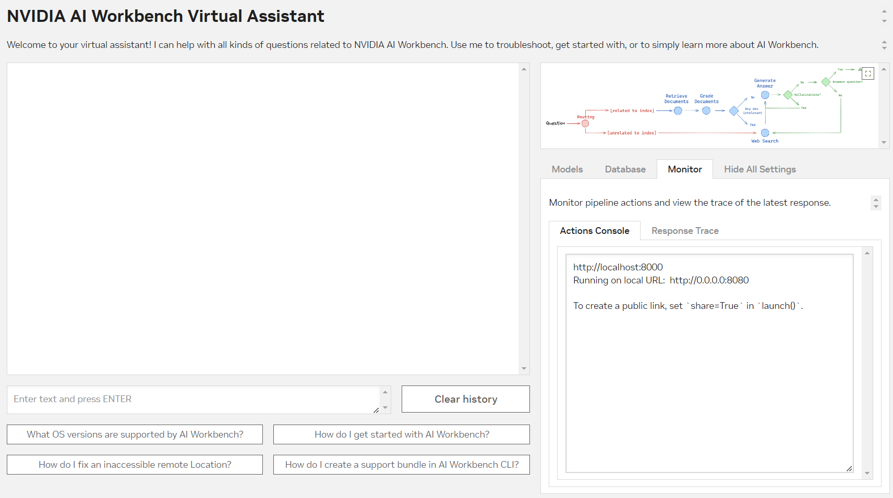

# Table of Contents
* [Introduction](#nvidia-ai-workbench-introduction-)
* [Project Description](#project-description)
  * [Project Deep Dive](#project-deep-dive)
  * [Sizing Guide](#sizing-guide)
* [Quickstart](#quickstart)
   * [Prerequisites](#prerequisites)
   * [Tutorial (Desktop App)](#tutorial-desktop-app)
     * [Share Your Assistant](#share-your-virtual-assistant)
     * [Customize Your Assistant](#customize-your-virtual-assistant)
   * [Tutorial (CLI-Only)](#tutorial-cli)
* [License](#license)

# NVIDIA AI Workbench: Introduction [](https://ngc.nvidia.com/open-ai-workbench/aHR0cHM6Ly9naXRodWIuY29tL05WSURJQS93b3JrYmVuY2gtZXhhbXBsZS1tdWx0aW1vZGFsLXZpcnR1YWwtYXNzaXN0YW50)

<!-- Banner Image -->


<!-- Links -->
<p align="center"> 
  <a href="https://www.nvidia.com/en-us/deep-learning-ai/solutions/data-science/workbench/" style="color: #76B900;">:arrow_down: Download AI Workbench</a> •
  <a href="https://docs.nvidia.com/ai-workbench/" style="color: #76B900;">:book: Read the Docs</a> •
  <a href="https://docs.nvidia.com/ai-workbench/user-guide/latest/quickstart/example-projects.html" style="color: #76B900;">:open_file_folder: Explore Example Projects</a> •
  <a href="https://forums.developer.nvidia.com/t/support-workbench-example-project-multimodal-virtual-assistant/309400" style="color: #76B900;">:rotating_light: Facing Issues? Let Us Know!</a>
</p>

# Project Description
This is an [NVIDIA AI Workbench](https://www.nvidia.com/en-us/deep-learning-ai/solutions/data-science/workbench/) project for developing a virtual product assistant that leverages a multimodal RAG pipeline with fallback to websearch to inform, troubleshoot, and answer user queries on the NVIDIA AI Workbench software product. Users will be able to leverage two powerful RAG-based chat applications:
* **Control-Panel**: This customizable gradio application enables users to add webpages, PDFs, images, and videos to a local LanceDB vectorstore and submit queries to them.
  * A starter knowledge base is included by default under ``Webpage URLs`` consisting of documentation, troubleshooting, and project README files.
  * Use this to get started, then add additional files to further augment the assistant!
  * Ready to focus the assistant on a different product? Check out this [guide](#customize-your-virtual-assistant) to find out how! 
* **Public-Chat**: With all documents loaded, this customizable gradio application is a "read-only" chatbot that developers can deploy to end users using the AI Workbench shareable-URL feature.
  * Find out how to share your apps [here](#share-your-virtual-assistant)

With either app, users can run inference with: 
  * **Cloud endpoints** using the [NVIDIA API Catalog](https://build.nvidia.com/explore/discover): These use NVIDIA-managed model endpoints to generate responses to user queries for easy accessibility. 
  * **Self-hosted endpoints** using [NVIDIA Inference Microservices (NIM)](https://www.nvidia.com/en-us/ai/): These are custom endpoints on self-managed hardware that can be used to generate responses while keeping the entire end-to-end flow 'in-house'. 
      * Third party self-hosted microservices that support the OpenAI API standard can be used as well, like Ollama.



_**Figure 1:** Above is an example of an end-user using the **Public-Chat** web app, a "read-only", pared down version of the main **Control-Panel** application that is meant to be more consumable and shareable to end-users._

Using LangGraph, user queries will first be sorted under a RAG or Websearch pipeline depending on an LLM evaluation of the query topic. Depending on its user-configurable prompt, the router LLM can narrow its focus on turning a specific subject or topic routable to the RAG Pipeline.



_**Figure 2:** This project uses a LangGraph-based workflow depicted in the above diagram to improve response quality in RAG._

<blockquote>
<details>
<summary>
<b>Expand this section for a description of RAG Pipeline.</b>
</summary>

Under the retrieval pipeline, the user query is first compared to documents in the vector database and the most relevant documents are retrieved. 

Another LLM call evaluates the quality of the documents. If satisfactory, it proceeds to the generation phase to produce an response augmented by this relevant context. If the agentic workflow decides the best documents are irrelevant to the query, it redirects the user query to the websearch pipeline for a better quality response (see below section). 

After generation, another set of LLMs calls evaluate the response for hallucinations and accuracy. If the generation is both faithful to the retrieved context and answers the user's query in a satisfactory manner, the response is forwarded to the user and displayed. Otherwise, the agentic workflow will either regenerate the response, or redirect the query to a web search. 

</details>

<details>
<summary>
<b>Expand this section for a description of Websearch Pipeline.</b>
</summary>

Under the web search pipeline, the user query is inputted onto the web and the search results are retrieved. Using these results, a response is generated. 

After generation, a set of LLMs calls evaluate the response for hallucinations and accuracy. If the generation is both faithful to the retrieved context and answers the user's query in a satisfactory manner, the response is forwarded to the user and displayed. Otherwise, the agentic workflow will either regenerate the response, or redirect the query to another web search. 

</details>
</blockquote>

| :memo: Remember             |
| :---------------------------|
| This project is meant as an example workflow and a starting point; you are free to add new models, rearrange the interface, or edit the source code as you see fit for your particular use case! |

## Project Deep Dive

<details>
<summary>
<b>Expand this section for a full guide of the user-configurable project settings</b>
</summary>

When the user lands on the main **Control-Panel** application in the browser, they will see several components (users on the **Public-Chat** app will see a similar but pared-down interface). On the left hand side is a standard chatbot user interface with a user input for queries (submittable with ``[ENTER]``) and a clear history button. Below this chatbot are several example queries the user can click on to submit.  

On the right hand side, users will see a collapsable settings panel with several tabs they may choose to navigate to and configure. 

<blockquote>
<details>
<summary>
<b>Expand for Model Settings.</b>
</summary>



This tab holds every user-configurable setting for each of the LLM components of the RAG pipeline: 

* **Router**: This component is responsible for routing the user query to the relevant pipeline
* **Retrieval Grader**: This component grades for relevant retrieved documents and filters out irrelevant documents. 
* **Generator**: This components uses the relevant retrieved documents as context to generate a response. 
* **Hallucination Grader**: This component grades the response based on faithfulness to the context.
* **Answer Grader**: This component grades the response based on whether it answers the original query. 

Expanding any such entry will yield a panel where users can specify the model they would like to use for that particular component from a dropdown (using NVIDIA API Catalog endpoints), or they can specify their own remotely running self-hosted NVIDIA NIM custom endpoint.

Below this field is an expandable accordion where users can adjust the default prompts for that particular component's task. For example, under the Router component, users can re-write and customize their prompt to focus on only routing queries relating to NVIDIA AI Workbench to the RAG pipeline and directing all other queries to the Websearch pipeline. 

**Note:** In the corresponding **Public-Chat** app, this tab is known as the **Architecture** tab. The principal difference is that while the user can select models to use, the prompts are fixed and not customizable for clarity and consistency in consumption and user experience. 

</details>

<details>
<summary>
<b>Expand for Database Settings.</b>
</summary>



This tab holds every user-configurable setting for the vector database and document ingestion aspects of this multimodal RAG pipeline. Users can upload their own webpages or Youtube URLs to the vector database by entering a newline-seperated list of URLs in the textbox and clicking Upload. Alternatively, they can upload their own PDF, image, and video files from their local machine to be stored in the vector datastore. 

**Note:** In the **Public-Chat** app, this tab does not exist to prevent the end user from altering the docs stored in the vectorstore. 

</details>


<details>
<summary>
<b>Expand for Monitoring Settings.</b>
</summary>



This tab holds the RAG monitoring tools built into this application to both give developers a handy debugging tool and users a glimpse behind the scenes of what happens when a response is generated by the virtual assistant. 

* The first tool is a console that logs all the actions being taken when processing the user query and provides a general overview into the agentic pipeline's decision making.
* The second tool is an in-depth trace of the actions for the last submitted query, which gives more detail into the context retrieved, websearch documents found, LLM pipeline components used, etc. when generating out the most recent response. 

</details>
</blockquote>

</details>

## Sizing Guide

| GPU VRAM | Example Hardware | Compatible? |
| -------- | ------- | ------- |
| N/A | CPU-Only | Y |
| <16 GB | RTX 3080, RTX 3500 Ada | Y |
| 16 GB | RTX 4080 16GB, RTX A4000 | Y |
| 24 GB | RTX 3090/4090, RTX A5000/5500, A10/30 | Y |
| 32 GB | RTX 5000 Ada  | Y |
| 40 GB | A100-40GB | Y |
| 48 GB | RTX 6000 Ada, L40/L40S, A40 | Y |
| 80+ GB | A100-80GB | Y |

# Quickstart

## Prerequisites
AI Workbench will prompt you to provide a few pieces of information before running any apps in this project. Ensure you have this information ready. 
   
   * An OpenAI API Key. You can generate one under ``Create new secret key`` on your OpenAI [account](https://platform.openai.com/api-keys)
   * An NVIDIA API Key. You can generate one under ``Get API Key`` on any API Catalog [model card](https://build.nvidia.com/mistralai/mistral-7b-instruct-v2)
   * A Tavily Search API Key. You can generate one under a free account (1000 searches/month) [here](https://app.tavily.com/home).

## Tutorial (Desktop App)

If you do not NVIDIA AI Workbench installed, first complete the installation for AI Workbench [here](https://www.nvidia.com/en-us/deep-learning-ai/solutions/data-science/workbench/). 

| :bulb: Tip              |
| :-----------------------|
| Working in the AI Workbench command-line interface (CLI)? Skip to the [next section](#tutorial-cli) for a CLI-only tutorial! |

Let's get started! 

1. Fork this Project to your own GitHub namespace and copy the link

   ```
   https://github.com/[your_namespace]/<project_name>
   ```
   
2. Open the NVIDIA AI Workbench App. Select a location to work in. 
   
3. Clone this Project onto your desired machine by selecting **Clone Project** and providing the GitHub link.
   
4. Wait for the project to build. You can expand the bottom **Building** indicator to view real-time build logs. 
   
5. When the build completes, set the following configurations.

   * `Environment` &rarr; `Secrets` &rarr; `Configure`. Specify the OpenAI API Key, NVIDIA API Key and Tavily Search Key as project secrets.

6. On the top right of the AI Workbench window, select **Control Panel**. A frontend user interface should automatically open in a new browser tab.

7. In the web app, select **Database** to upload the relevant documents to the virtual product assistant vectorstore. Some default docs are provided as a starting point, but you may supply your own to further augment your virtual assistant. Heads up, depending on file size, this upload process may take a while!

8. Submit a query related to the NVIDIA AI Workbench product, or select a default query to use. Happy chatting!

### Share Your Virtual Assistant

<blockquote>
<details>
<summary>
<b>Want to share this virtual product assistant with others? Expand this to find out how! </b>
</summary>

What is the point of a virtual product assistant if you can't share it with people who would use it? 

Fortunately, NVIDIA AI Workbench provides an easy solution to share access to your currently running applications to external users, even if they do not have AI Workbench installed on their systems. All they need to do is drop a generated URL into their browser window. Let's find out how to do this with this project. 

Here, we will demonstrate how to share **Public-Chat**, a "read-only" version of the frontend chatbot mentioned above. "Read-only" just means the end user of this application cannot alter the backend, eg. cannot delete documents stored in the vectorstore, cannot add new documents, etc. In other words, we want our end users to consume what we have built in the **Control-Panel** in their own contained application. 

**Note:** This feature is only available on **remote** contexts/locations via the AI Workbench **CLI**. 
* Make sure your remote context is updated to the most recent version compatible with your local AI Workbench.
* Make sure your remote context is open and accessible to the desired users you would like to access your project. 

Let's get started! 

1. Open a terminal window in your local AI Workbench. If working in Windows, open the **NVIDIA-Workbench** WSL2 distro.
2. Activate the **remote** context holding your project in **external-access** mode with the following command: 

   ```
   $ nvwb activate <remote_context> --external-access
   ```

3. Open the project with: 

   ```
   $ nvwb open <project-name> 
   ```

4. Start the container and run the application you want to share: 

   ```
   $ nvwb start public-chat
   ```

5. Create the shareable URL with this command, and select from the dropdown: 

   ```
   $ nvwb create share-url
   ```

6. Copy the URL and send it to the desired person. The link is good **per-person, per-browser**, so make sure you do not accidentally open it yourself. 

</details>
</blockquote>

### Customize Your Virtual Assistant

<blockquote>
<details>
<summary>
<b>Want to point this assistant to a different subject? Expand this to learn more! </b>
</summary>

Provided out-of-the-box are some sample documents and prompts on the NVIDIA AI Workbench product to be stored in the vectorstore and used as part of the RAG pipeline. But what if we want to convert this assistant to be an expert on a completely different product or subject altogether? 

Fortunately, we can do this relatively easily with the following steps:

1. I need something temporary, eg. for quick testing on an already-open application.
   * Inside the browser window for **Control-Panel**, navigate to **Database** and swap out the any placeholders with your own data. Upload your own data if you would like.
   * Navigate to **Models**, expand the **Router** and **Configure the Router Prompt**. Edit that prompt to focus the assistant on the product or subject of your choice. You can now submit a query to test out your assistant, but the new prompt will not persist past this session. 

2. I need something more permanent. I want to make this project my own.
   * Open **Jupyterlab** or an IDE of your choice to edit the source code.
   * Open ``code/chatui/prompts`` (permanently edits the **Control-Panel** app) and ``code/chatui_public/prompts`` (permanently edits the **Public-Chat** app)
     * ``prompts_llama3.py``: Edit the **Router** prompt to focus the assistant on the product or subject of your choice. 
     * ``prompts_mistral.py``: Edit the **Router** prompt to focus the assistant on the product or subject of your choice. 
     * ``defaults.py``: Provide your default docs here, if desired.
   * Now, when you upload your own data, your assistant is now built to automatically and persistently focus on your product or subject of choice, right out of the box. 

</details>
</blockquote>

## Tutorial (CLI)

<details>
<summary>
<b>Working in the CLI? Expand this for the CLI-only Tutorial!</b>
</summary>

Some users may choose to use the **CLI tool only** instead of the Desktop App. If you do not NVIDIA AI Workbench installed, first complete the installation for AI Workbench [here](https://www.nvidia.com/en-us/deep-learning-ai/solutions/data-science/workbench/). Then, 
1. Fork this Project to your own GitHub namespace and copying the link

   ```
   https://github.com/[your_namespace]/<project_name>
   ```
   
2. Open a shell and activating the Context you want to clone into by

   ```
   $ nvwb list contexts
   
   $ nvwb activate <desired_context>
   ```

   | :bulb: Tip                  |
   | :---------------------------|
   | Use ```nvwb help``` to see a full list of  AI Workbench commands. |
   
3. Clone this Project onto your desired machine by running

   ```
   $ nvwb clone project <your_project_link>
   ```
   
4. Open the Project by

   ```
   $ nvwb list projects
   
   $ nvwb open <project_name>
   ```

5. Start **Control-Panel** by

   ```
   $ nvwb start control-panel
   ```

   * Specify the OpenAI API Key, NVIDIA API Key and Tavily Search Key as project secrets.

6. A frontend user interface should automatically open in a new browser tab. Happy chatting!

7. In the web app, select **Database** to upload the relevant documents to the virtual product assistant vectorstore. Some default docs are provided as a starting point, but you may supply your own to further augment your virtual assistant. Heads up, depending on file size, this upload process may take a while!

8. Submit a query related to the NVIDIA AI Workbench product, or select a default query to use. Happy chatting!

</details>

# License
This NVIDIA AI Workbench example project is under the [Apache 2.0 License](https://github.com/NVIDIA/workbench-example-multimodal-virtual-assistant/blob/main/LICENSE.txt)

This project may utilize additional third-party open source software projects. Review the license terms of these open source projects before use. Third party components used as part of this project are subject to their separate legal notices or terms that accompany the components. You are responsible for confirming compliance with third-party component license terms and requirements. 

| :question: Have Questions?  |
| :---------------------------|
| Please direct any issues, fixes, suggestions, and discussion on this project to the DevZone Members Only Forum thread [here](https://forums.developer.nvidia.com/t/support-workbench-example-project-multimodal-virtual-assistant/309400) |
